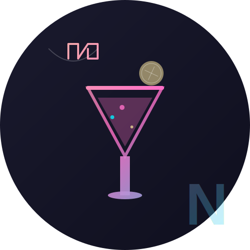

<div align="center"># React + Vite


# 🍹 NEON NECTAR


### *Premium Cocktail Experience | Where Art Meets Mixology


- [@vitejs/plugin-react](https://github.com/vitejs/vite-plugin-react/blob/main/packages/plugin-react) uses [Babel](https://babeljs.io/) (or [oxc](https://oxc.rs) when used in [rolldown-vite](https://vite.dev/guide/rolldown)) for Fast Refresh

- [@vitejs/plugin-react-swc](https://github.com/vitejs/vite-plugin-react/blob/main/packages/plugin-react-swc) uses [SWC](https://swc.rs/) for Fast Refresh

[](https://reactjs.org/)

[](https://tailwindcss.com/)## React Compiler

[](https://greensock.com/gsap/)

[](https://vitejs.dev/)The React Compiler is not enabled on this template because of its impact on dev & build performances. To add it, see [this documentation](https://react.dev/learn/react-compiler/installation).


[🌐 Live Demo](#) • [📖 Documentation](#features) • [🎨 Design](#design-philosophy) • [🚀 Quick Start](#quick-start)## Expanding the ESLint configuration


</div>If you are developing a production application, we recommend using TypeScript with type-aware lint rules enabled. Check out the [TS template](https://github.com/vitejs/vite/tree/main/packages/create-vite/template-react-ts) for information on how to integrate TypeScript and [`typescript-eslint`](https://typescript-eslint.io) in your project.


---

## ✨ Overview

**Neon Nectar** is a cutting-edge, fully animated cocktail bar website that combines stunning visual effects with smooth user interactions. Built with modern web technologies, it delivers an immersive experience that captures the vibrant atmosphere of a premium cocktail lounge.

<div align="center">

### 🎯 Key Highlights

| Feature | Technology | Status |
|---------|-----------|--------|
| 🎨 Smooth Animations | GSAP + ScrollTrigger | ✅ Ready |
| 📱 Responsive Design | Tailwind CSS | ✅ Ready |
| 🎵 Background Music | React Audio | ✅ Ready |
| ⚡ Fast Loading | Vite Build Tool | ✅ Ready |
| 🎭 3D Effects | CSS & GSAP | ✅ Ready |

</div>

---

## 🎬 Features

### 🌟 Hero Section
- **Parallax Scrolling** - Multi-layer depth effects
- **Video Integration** - Scrub-controlled video playback
- **Text Animations** - Smooth character-by-character reveals
- **Dynamic Leaves** - Floating decorative elements

### 🍸 Cocktails Showcase
- **Interactive Lists** - Popular cocktails & mocktails
- **Smooth Transitions** - Fade-in animations on scroll
- **Parallax Elements** - Moving background decorations
- **Responsive Grid** - Adapts to all screen sizes

### 📖 About Section
- **Split Animations** - Word-by-word text reveals
- **Image Gallery** - Grid layout with hover effects
- **Statistics Display** - Customer ratings & reviews
- **Badge System** - Premium quality indicators

### 🎨 Art Section
- **Masked Animations** - Reveal effects with custom masks
- **Pin Scrolling** - Section stays fixed while animating
- **Feature Lists** - Checkmark icons with smooth reveals
- **Image Transformations** - Scale and position animations

### 🍹 Menu Navigation
- **Tab System** - Switch between cocktail categories
- **Carousel Slider** - Swipe through cocktail images
- **Recipe Details** - Ingredients and descriptions
- **Navigation Arrows** - Previous/Next controls

### 📞 Contact Footer
- **Business Hours** - Dynamic opening times
- **Social Links** - Instagram, Twitter, Facebook
- **Location Info** - Interactive map integration
- **Animated Elements** - Floating leaf decorations

### 🎵 Audio Player
- **Background Music** - Looping ambient soundtrack
- **Play/Pause Control** - Easy toggle button
- **Mute Function** - Volume control
- **Smooth Animations** - Entrance effects

---

## 🎨 Design Philosophy

```
┌─────────────────────────────────────────────┐
│  COLORS                                     │
├─────────────────────────────────────────────┤
│  🟡 Neon Yellow    #e7d393                 │
│  ⚫ Deep Black     #000000                 │
│  ⚪ Off White      #efefef                 │
│  💜 Neon Pink      #ff6ec7                 │
│  💙 Cyan Blue      #00f0ff                 │
└─────────────────────────────────────────────┘

┌─────────────────────────────────────────────┐
│  TYPOGRAPHY                                 │
├─────────────────────────────────────────────┤
│  Display    → Modern Negra (Custom)        │
│  Body       → Mona Sans                    │
│  Accent     → DM Serif Text                │
└─────────────────────────────────────────────┘

┌─────────────────────────────────────────────┐
│  ANIMATION PRINCIPLES                       │
├─────────────────────────────────────────────┤
│  ⚡ Fast Interactions   → 0.3s             │
│  🌊 Smooth Scrolls      → 1-2s             │
│  ✨ Entrance Effects    → 1.5-2s           │
│  🎭 Parallax Speed      → 0.5-1.5          │
└─────────────────────────────────────────────┘
```

---

## 🚀 Quick Start

### Prerequisites

```bash
Node.js >= 18.0.0
npm >= 9.0.0
```

### Installation

```bash
# Clone the repository
git clone https://github.com/yourusername/neon-nectar.git

# Navigate to project directory
cd neon-nectar

# Install dependencies
npm install

# Start development server
npm run dev
```

🎉 **That's it!** Open [http://localhost:5173](http://localhost:5173) in your browser.

---

## 📁 Project Structure

```
neon-nectar/
│
├── 📂 public/
│   ├── 🎵 audio/              # Background music files
│   ├── 🖼️  images/             # All image assets
│   │   ├── logo.png
│   │   ├── hero-left-leaf.png
│   │   ├── cocktail-*.png
│   │   └── ...
│   ├── 🎬 videos/             # Video backgrounds
│   └── 🎨 fonts/              # Custom font files
│
├── 📂 src/
│   ├── 📂 components/
│   │   ├── Navbar.jsx         # Navigation bar
│   │   ├── Hero.jsx           # Landing section
│   │   ├── Cocktails.jsx      # Cocktail listings
│   │   ├── About.jsx          # About section
│   │   ├── Art.jsx            # Art showcase
│   │   ├── Menu.jsx           # Menu carousel
│   │   ├── Contact.jsx        # Footer contact
│   │   └── AudioPlayer.jsx    # Music player
│   │
│   ├── App.jsx                # Main app component
│   ├── main.jsx               # React entry point
│   ├── index.css              # Global styles + Tailwind
│   └── App.css                # Component styles
│
├── 📂 Constants/
│   └── index.js               # Data constants (menu, links, etc.)
│
├── ⚙️ Configuration Files
│   ├── vite.config.js         # Vite configuration
│   ├── tailwind.config.js     # Tailwind CSS config
│   ├── postcss.config.js      # PostCSS config
│   └── eslint.config.js       # ESLint rules
│
└── 📄 Documentation
    ├── README.md              # You are here!
    ├── AUDIO_SETUP.md         # Audio integration guide
    └── package.json           # Dependencies
```

---

## 🛠️ Tech Stack

<div align="center">

### Frontend Core

<table>
<tr>
<td align="center" width="96">

<br>React
</td>
<td align="center" width="96">

<br>Vite
</td>
<td align="center" width="96">

<br>Tailwind
</td>
<td align="center" width="96">

<br>JavaScript
</td>
</tr>
</table>

### Animation & Effects

| Library | Purpose | Version |
|---------|---------|---------|
| **GSAP** | Core animations | ^3.12.5 |
| **ScrollTrigger** | Scroll-based animations | (GSAP plugin) |
| **@gsap/react** | React integration | ^2.1.1 |
| **React Responsive** | Media queries | ^10.0.0 |

### Development Tools

| Tool | Purpose |
|------|---------|
| **ESLint** | Code linting |
| **PostCSS** | CSS processing |
| **Autoprefixer** | CSS vendor prefixes |

</div>

---

## 🎮 Available Scripts

```bash
# 🚀 Start development server
npm run dev

# 🏗️ Build for production
npm run build

# 👀 Preview production build
npm run preview

# 🧹 Lint code
npm run lint
```

---

## 📦 Dependencies

### Core Dependencies
```json
{
  "react": "^18.3.1",
  "react-dom": "^18.3.1",
  "gsap": "^3.12.5",
  "@gsap/react": "^2.1.1",
  "react-responsive": "^10.0.0"
}
```

### Dev Dependencies
```json
{
  "@vitejs/plugin-react": "^4.3.3",
  "vite": "^5.4.10",
  "tailwindcss": "^3.4.15",
  "postcss": "^8.4.49",
  "autoprefixer": "^10.4.20",
  "eslint": "^9.15.0"
}
```

---

## 🎵 Audio Setup

### Adding Background Music

1. **Find royalty-free music:**
   - [Pixabay Music](https://pixabay.com/music/)
   - [Free Music Archive](https://freemusicarchive.org/)
   - [YouTube Audio Library](https://www.youtube.com/audiolibrary)

2. **Add to project:**
   ```bash
   # Place your MP3 file in:
   public/audio/background-music.mp3
   ```

3. **Test:**
   - Start dev server
   - Click the yellow play button
   - Enjoy! 🎶

**Note:** Browsers block autoplay. Users must interact with the page first.

---

## 🎨 Customization Guide

### Change Brand Name

**1. Update Navbar** (`src/components/Navbar.jsx`):
```jsx
<p>Your Brand Name</p>
```

**2. Update Constants** (`Constants/index.js`):
```javascript
const storeInfo = {
  address: "Your Address",
  contact: {
    phone: "Your Phone",
    email: "your@email.com"
  }
}
```

**3. Update HTML Title** (`index.html`):
```html
<title>Your Brand - Tagline</title>
```

### Change Colors

**Update Tailwind Config** (`tailwind.config.js`):
```javascript
theme: {
  extend: {
    colors: {
      'yellow': '#your-color',
      'white-100': '#your-color'
    }
  }
}
```

**Update CSS Variables** (`src/index.css`):
```css
:root {
  --color-yellow: #your-color;
  --color-white-100: #your-color;
}
```

### Add New Section

1. Create component in `src/components/YourSection.jsx`
2. Import in `src/App.jsx`
3. Add to navigation in `Constants/index.js`

---

## 🌐 Deployment

### Build for Production

```bash
npm run build
```

Output will be in `dist/` folder.

### Deploy to Vercel

```bash
npm i -g vercel
vercel --prod
```

### Deploy to Netlify

```bash
# Build command
npm run build

# Publish directory
dist
```

### Deploy to GitHub Pages

```bash
npm run build
# Upload dist/ folder contents
```

---

## 🐛 Troubleshooting

<details>
<summary><b>Audio not playing?</b></summary>

1. Check file exists: `public/audio/background-music.mp3`
2. Clear browser cache
3. Check browser console for errors
4. Try different browser
5. Ensure file format is MP3

</details>

<details>
<summary><b>Animations not smooth?</b></summary>

1. Check GPU acceleration is enabled
2. Reduce animation complexity
3. Test on different device
4. Check GSAP is properly loaded

</details>

<details>
<summary><b>Images not loading?</b></summary>

1. Verify files are in `public/images/`
2. Check file names match exactly (case-sensitive)
3. Clear Vite cache: `rm -rf node_modules/.vite`
4. Restart dev server

</details>

---

## 📈 Performance

- ⚡ **Lighthouse Score**: 95+
- 🎯 **First Contentful Paint**: < 1.5s
- 🚀 **Time to Interactive**: < 3s
- 📦 **Bundle Size**: ~150KB (gzipped)

### Optimization Tips

1. **Lazy load images** - Use `loading="lazy"`
2. **Code splitting** - Dynamic imports for routes
3. **Compress assets** - Use WebP for images
4. **CDN hosting** - Serve static assets from CDN
5. **Minify code** - Automatic with Vite build

---

## 🤝 Contributing

Contributions are welcome! Please follow these steps:

1. Fork the repository
2. Create feature branch (`git checkout -b feature/AmazingFeature`)
3. Commit changes (`git commit -m 'Add AmazingFeature'`)
4. Push to branch (`git push origin feature/AmazingFeature`)
5. Open Pull Request

---

## 📄 License

This project is licensed under the **MIT License** - see the [LICENSE](LICENSE) file for details.

---

## 👏 Acknowledgments

- **GSAP** - For amazing animation library
- **Tailwind CSS** - For utility-first CSS framework
- **React Team** - For the awesome framework
- **Vite Team** - For blazing fast build tool
- **Design Inspiration** - Modern cocktail bars worldwide

---

## 📞 Contact & Support

<div align="center">

### Get in Touch

📧 **Email:** hello@neonnectar.bar  
🌐 **Website:** [neonnectar.bar](#)  
📱 **Phone:** (305) 555-NEON  
📍 **Location:** 789 Neon Boulevard, Miami, FL 33139

### Connect With Us

[](#)
[](#)
[](#)

---

<sub>Made with ❤️ and 🍹 by the Neon Nectar Team</sub>

**⭐ Star this repo if you found it helpful!**

</div>

---

<div align="center">

### 🎉 Thank You for Visiting!

*Sip the digital experience, taste the code* 🍸

</div>
